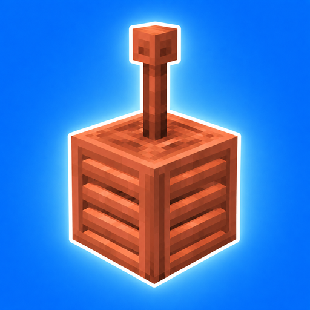

<p align="center">
  
</p>

<h1 align="center">Electra</h1>

<p align="center">
  <b>Physical, industrial and modular electricity — deeply integrated into Minecraft.</b>
</p>

<p align="center">
  
  
  
  
  <a href="https://discord.gg/buQYNmuEkR"></a>
</p>

---

## About

**Electra** is a vanilla+ tech mod built around **electricity, copper and visible infrastructure**.

Electra does not hand you finished machines that solve everything. It gives you **building blocks** — cables, generators, machines, logic components — and lets you do the engineering. A casual player can power a few machines with a lightning rod; an expert can build entire factories, control panels, or even a computer.

> The mod provides the tools. The player provides the engineering.

Core principles:

- **Everything stays physical.** Cables exist in the world, chests stay chests, factories are visible.
- **Complexity is optional.** Simple setups are easy; deep setups are possible.
- **No material makes the previous one obsolete.** Endgame builds combine several materials, each with its own role.
- **Built for modpacks.** Electra uses standard Forge Energy (FE) and is designed to work *with* other tech mods, not replace them.

---

## Features (Beta 0.1.0)

### ⚡ Energy network
- Standard **Forge Energy (FE)**, compatible with any FE-based mod.
- Connected cables form a **shared network** that pulls from generators and distributes evenly to machines.
- 1,000 FE/t per connected machine, 10,000 FE buffer per cable segment.

### 🔌 Cables
- **Bare Wire** — cheap copper cable. Connects to everything. **Electrocutes** players and mobs who touch it while powered.
- **Insulated Wire** — wrapped in wool, safe to touch, available in **16 colours**.
  - Insulated wires only connect to the same colour or to bare wire, so you can run separate networks side by side.

### 🌩️ Lightning Collector
- The first source of power: place a **lightning rod** on top and wait for a storm.
- Each strike stores **5,000 FE** (up to 1,000,000 FE).
- When charged, a glowing energy core spins inside the cage and the block emits light.

### 🔥 Advanced Furnace
- Electric furnace: smelts anything a furnace, blast furnace or smoker can (100 FE per item).
- **Alloy smelting** with two input slots.
- Hopper and pipe compatible (inputs from the top and sides, output from the bottom).

### 🔴 Redstone Converter
- Emits a redstone signal when an adjacent cable network holds energy.

### 📟 Energy Meter
- Hold it and look at any FE block — Electra's or another mod's — to read its stored energy.

### 🧪 Materials
| Material | How to get it | Role |
|---|---|---|
| **Rose Gold** | Copper + Gold in the Advanced Furnace | Advanced technology and automation |
| **Red Iron Alloy** | Iron + Redstone in the Advanced Furnace | Magnetic properties (power generation) |

Both come with ingots and storage blocks, and are tagged under `c:ingots/*` and `c:storage_blocks/*` for cross-mod recipes.

---

## Getting started

1. **Lightning Collector** — copper ingots, a lightning rod and copper blocks.
2. Place a **lightning rod** on top of it.
3. Craft **Bare Wire** (3 copper ingots → 8 wires) and connect it to an **Advanced Furnace**.
4. During a thunderstorm, every strike on the rod charges the collector, and the network feeds the furnace.
5. Put a copper ingot and a gold ingot in the furnace to make your first **Rose Gold**.

> 💡 Tip: wrap your cables in wool before running them through your base. Bare wire hurts.

---

## Roadmap

| Update | Theme |
|---|---|
| **0. Core** | FE network, cables, Lightning Collector, Redstone Dynamo, Netherstar Reactor, basic machines, logic components, lamps |
| **1. End** | Storage network (between Tom's Simple Storage and AE2), spatial technology |
| **2. Rose Gold Golem** | Physical automation workers: sorting, crafting, farming, breeding |
| **3. Sculk** | Wireless signals, information and synchronisation |
| **4. Trains** | Powered copper rails, braking, linked minecart convoys |
| **5. Breeze** | Wind propulsion blocks for players, mobs and items |
| **6. Sulfur** | Chemical industry, Sulfur Energy Cells, Mining Bomb |

Energy progression: **Lightning Collector → Redstone Dynamo → Netherstar Reactor**
*Harness nature → Industrialise electricity → Master an extreme energy source.*

---

## Compatibility

Electra is designed to coexist with:

- **Create** — Create handles kinetics, Electra handles electricity.
- **AE2 / Tom's Simple Storage** — Electra's future storage network sits between the two, and keeps inventories physical.
- **Any FE mod** (Mekanism, Thermal, etc.) — cables and machines expose standard FE capabilities.

JEI integration is planned.

---

## Installation

1. Install **NeoForge** for Minecraft **1.21.1**.
2. Download Electra from CurseForge or the [Releases](../../releases) page.
3. Drop the `.jar` into your `mods` folder.

Electra is required on **both client and server**.

---

## Building from source

Requirements: **Java 21**.

```bash
git clone https://github.com/GuillaumeBousignac/Electra.git
cd Electra
./gradlew build
```

The mod jar is generated in `build/libs/`.

To launch a development client:

```bash
./gradlew runClient
```

---

## Contributing & feedback

Electra is in **beta** and community feedback shapes its development.

- 💬 **Discord**: join the community, follow development and test betas — [discord.gg/buQYNmuEkR](https://discord.gg/buQYNmuEkR)
- 🐛 **Bugs and suggestions**: open an [issue](../../issues).
- 🔧 **Pull requests** are welcome — please open an issue first for larger changes.
- 🧩 **Addons**: Electra is meant to grow into an ecosystem. New materials, machines and integrations are encouraged.

---

## License

See [LICENSE](LICENSE).